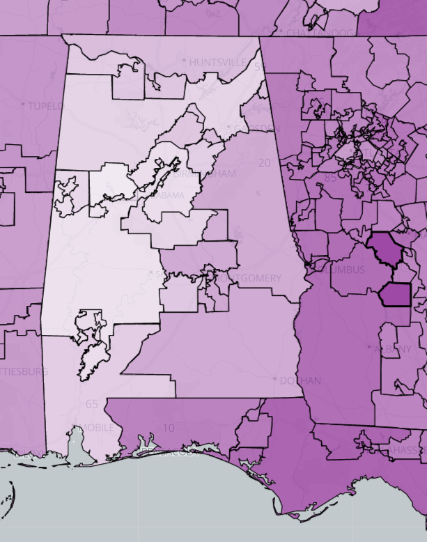
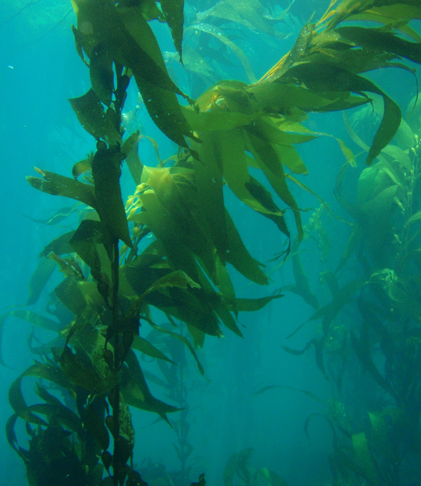

<!DOCTYPE html>
<html lang="en">

  <head>

    <title>Joel Salzman</title>

    <!-- Import theme and scripts -->
    <link rel="stylesheet" type="text/css" href="theme.css">
    

  </head>

  <!---------------------------------------------------------------------------------->

  <body style="background-color: #e1f1c4;">

    <!-- Initial view -->
    

      

      

        <h1 class="home" id="joel">Joel Salzman</h1>
        <h2 class="home">Geospatial Developer & Analyst</h2>
      

    

    <!-- Sticky header -->
    <header id="sticky-header">

      <!-- Links -->
      

        <a class="button button-bordered" id="button-hire" onclick="popup('contact')">CONTACT</a>
        
        
        
      

      <!-- Homepage tabs -->
      

        
        <a class="button button-main" id="button-education" href="#Education">Education</a>
        <a class="button button-main" id="button-experience" href="#Experience">Experience</a>
        <a class="button button-main" id="button-skills" href="#Skills">Skills</a>
        <a class="button button-main" id="button-portfolio" href="#Portfolio">Portfolio</a>
      

      
    </header>

    <!-- The important stuff -->
    

      <!-- Fun with SVG 
      -->

      <!-- Transition -->
      

        

      

      <!-- Informational sections -->
      

          
        

            
          <h2>University of California, Santa Barbara</h2>
            
              I will graduate Magna Cum Laude in June 2020 with two Bachelors of Arts. 
              During my third year, I was inducted into <a href="https://www.pbk.org/">Phi Beta Kappa</a>.
              
              I competed as part of the UCSB Climbing Team throughout college.
              While a staff member of <a href="http://recreation.sa.ucsb.edu/adventure-programs">UCSB Adventure Programs</a>,
                I led and assisted outdoor excursions, 
                facilitated activities at the UCSB Ropes Course, 
                and managed shifts at Campus Point Rentals.
            
          
          <h3>Geography (Geographic Information Science)</h3>
            
              My degree in "Where?"
                
              My coursework included advanced transportation modeling, suitability mapping, and remote sensing of the environment. 
              In addition, I helped redesign the labs for the main undergraduate GIS class and tutored classmates in ArcPy.
            
            

              <h3>Research Topics</h3>
              

              
Indoor cartography
:
              I under the direction of Professor <a href="http://www.geog.ucsb.edu/~kclarke/">Keith Clarke</a>.
              We built 3D models of indoor spaces and segmented point meshes to validate deep learning classifications of LIDAR scans. 
              Our goal was to develop a programatic method of generating millimeter-accurate models using LIDAR.
                

              
Voting
:
              I led a team of undergraduates in researching where votes have mattered most across the United States in
                federal elections in the past twenty years. 
              I later performed a similar analysis independently using more complex tools.
              Using Leaflet, I turned the results of the most recent analysis into an <a href="./gdvp.html">interactive map</a>.
                
              I'm also developing an algorithm to identify precincts with inordinately diluted voting power
                for use as potential evidence of gerrymandering. 
              The algorithm utilizes iterative swapping techniques to model potential fluctuations on the vote-seats curve.
            

          
          <h3>Philosophy (Ethics and Public Policy)</h3>
             
              My degree in "Why?"
                
              My interests primarily concern political ethics and metaphysics.
              The coursework most relevant to GIS were my studies of spatial ontology, predicate calculus, and data ethics.
            

          <h2>Foreign Study and Travel</h2>
            
              I took a gap year during which I worked and then backpacked independently around South America for
                about nine months. In that time my Spanish improved to the point of fluency, I volunteered with
                <a href="https://wwoof.net/">WWOOF</a>, and I took classes on local cuisine.
                
              During the Fall of 2019, I studied at <a href="https://kcl.ac.uk/">King's College London</a>. 
              While there, I took advanced modules in computer science and philosophy.
            
        

      

      

        

            
          <h2>SeaSketch</h2>
          
(March 2020 - Present)  

            
              <a href="https://www.seasketch.org/">SeaSketch</a> is a GIS application developed by
                <a href="https://www.nceas.ucsb.edu/">NCEAS</a> for conservation-focused marine spatial planning.
                My job consists of wrangling data with our partners across the world, 
                  writing analysis tools for individual projects,
                  and assisting with the development of SeaSketch 2.0.
            
          
          <h2>Apex Clean Energy</h2>
          
(Summer 2020)  

            
              <a href="https://www.apexcleanenergy.com/">Apex Clean Energy</a> is a wind and solar developer based 
                out of Charlottesville, Virginia. My role at Apex was to determine where to site new utility-scale 
                facilities.
                
              As an intern in the New Markets division, I dove deep into potential markets, found relevant data, 
                and presented my findings to members of the New Markets, GIS, and Business Development teams.
                The types of research that I conducted included opposition analysis,
                estimating the siting criteria of downstream industries, 
                and strategies for optimizing energy storage.
                I ultimately presented the results of one research project directly to the CEO. 
                
              Since I was the GIS intern for New Markets, my research often relied on geospatial data. 
                I created numerous Python tools to assist both the New Markets and dedicated GIS teams, 
                  including geocoders, web scrapers, and geometric manipulation scripts. 
                Many of my deliverables were service layers that were published to the company web map.
                I also started a collaborative Python package, <i>Apyx</i>, to increase efficiency across teams by
                  generalizing common geoprocessing workflows.
            
          
          <h2>Primary Ocean Producers</h2>
          
(Summer 2019)  

            
              <a href="http://www.primaryocean.com/">Primary Ocean Producers</a> is an aquaculture startup. 
              They partnered with <a href="https://catalinasearanch.com/">Catalina Sea Ranch</a> to fulfill an
                <a href="https://arpa-e.energy.gov/?q=programs/mariner">ARPA-E MARINER</a> contract to determine 
                the most suitable regions in federal and state waters to grow giant kelp (<i>Macrocystis pyrifera</i>). 
                
              My role as the GIS Specialist was to handle all of the non-binary siting factors and generate
                presentable seasonal and annual suitability maps for the Southern California region. 
                One of these maps can be found <a href="#Portfolio">below</a>.
              I also coordinated with NOAA and ARPA-E to acquire data and document our progress as required.
            
        

      

      
      

        

            
          <table>
            <tr><td colspan=3><h2>Human Languages</h2></td></tr>
            <tr>
              <td class="skillName">English</td>
              <td class="skillName">Spanish</td>
            </tr>
            <tr>
              <td class="skillImg skill_1"></td>
              <td class="skillImg skill_1"></td>
            </tr>

            <tr><td colspan=3><h2>Robot Languages</h2></td></tr>
            <tr>
              <td class="skillName">Python</td>
              <td class="skillName">R</td>
              <td class="skillName">SQL (Post, MS)</td>
            </tr>
            <tr>
              <td class="skillImg skill_1"></td>
              <td class="skillImg skill_2"></td>
              <td class="skillImg skill_2"></td>
            </tr>
            <tr>
              <td class="skillName">HTML</td>
              <td class="skillName">CSS</td>
              <td class="skillName">JavaScript</td>
            </tr>
            <tr>
              <td class="skillImg skill_1"></td>
              <td class="skillImg skill_1"></td>
              <td class="skillImg skill_2"></td>
            </tr>
            <tr>
              <td class="skillName">C++ </td>
              <td class="skillName">Java</td>
              <td class="skillName">Scala</td>
            </tr>
            <tr>
              <td class="skillImg skill_2"></td>
              <td class="skillImg skill_3"></td>
              <td class="skillImg skill_3"></td>
            </tr>

            <tr><td colspan=3><h2>Applications</h2></td></tr>
            <tr>
              <td class="skillName">ESRI Stack</td>
              <td class="skillName">QGIS</td>
              <td class="skillName">ENVI</td>
            </tr>
            <tr>
              <td class="skillImg skill_1"></td>
              <td class="skillImg skill_2"></td>
              <td class="skillImg skill_2"></td>
            </tr>
            <tr>
              <td class="skillName"></td>
            </tr>
            <tr>
              <td class="skillImg"></td>
            </tr>
          </table>

        

      

      <!-- Another transition -->
      

        

      

      <!-- Cards for portfolio items -->
      

        <a href="./gdvp.html">
          

            
          
 
        </a>

        

          

            <h2 class="card-text" id="card-text-header">This website</h2>
            
I wrote this interactive resume from scratch.

            
My skill with front-end web development enables me to produce custom web mapping applications.

          

        
 

        

          
        

      

    

    <!-- Imagebox for aquaculture maps -->
    

      

      

        
      

    

    <!-- Contact popup -->
    

      

      

          <h2 class="contact-div" id="email">joelkevlessalzman@gmail.com</h2>
      

    

  </body>

  <!-- Load the JavaScript -->
  
  

</html>